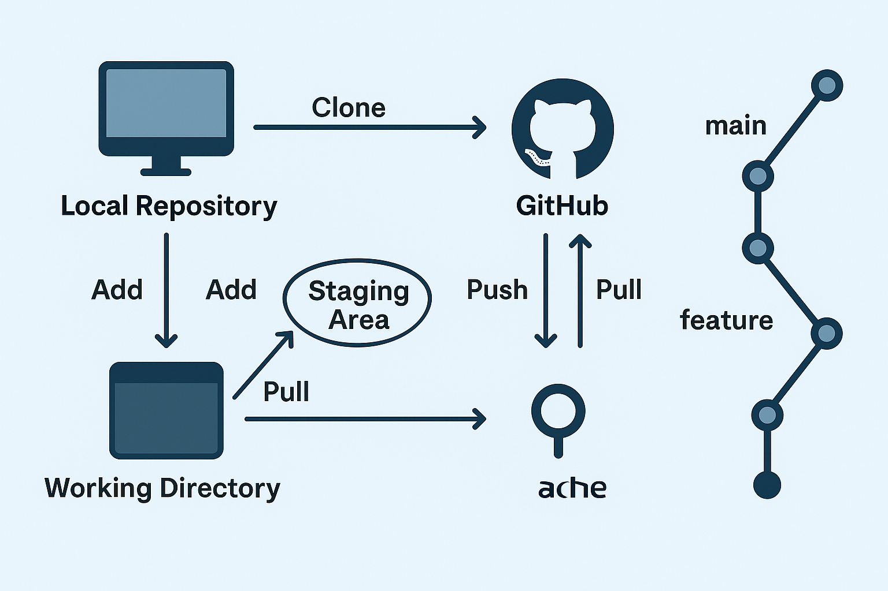
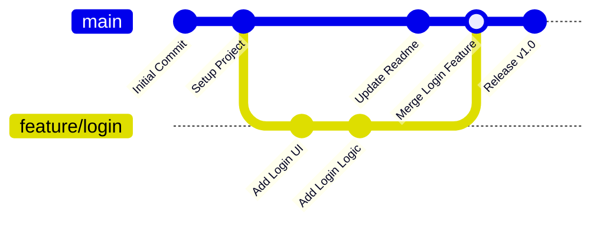

# 📝 Learn GitHub

Authors:

- Bruno Silva

## 🛠️ Local Environment Setup

Follow these steps to configure your local development environment:

### 1. Install Visual Studio Code (VS Code)

Download and install VS Code:  
https://code.visualstudio.com/

Recommended Extensions for Beginners:

- **Live Server** (for previewing HTML/CSS)
- **Prettier** (code formatting)
- **ESLint** (JavaScript linting)
- **VSCode Icons** (better file icons)

---

### 2. Install Node.js

Download and install Node.js (LTS recommended):  
https://nodejs.org/

This will also install **npm** (Node Package Manager), which is required for installing JavaScript dependencies.

Verify installation:

```bash
node -v
npm -v

```

### 3. Install Git

- Download and install Git: https://git-scm.com/downloads

After installing, configure your Git identity:

```bash
git config --global user.name "Your Name"
git config --global user.email "your-email@example.com"
```

### 🔧 Additional Recommended Setup (Optional but Helpful)

- Install GitHub Desktop (Beginner Friendly)

- GUI tool for Git operations: https://desktop.github.com/

- Install a Web Browser for Development

- Google Chrome: https://www.google.com/chrome/

- Firefox Developer Edition: https://www.mozilla.org/firefox/developer/

#### Create a Project Folder

- Organize your files:

```bash
mkdir my-project
cd my-project
```

#### Install VSCode Command-Line Tools

(Enables code . to open projects)

In VS Code → Command Palette →
"Shell Command: Install 'code' command in PATH"

---

## About GitHub



### 🌐 What is GitHub?

GitHub is an online platform used to **store**, **share**, and **collaborate on code**.  
It allows developers to keep their projects in remote repositories, track changes over time, and work together without overwriting each other’s work.

Key features:

- Remote storage for your code (like Google Drive, but for developers)
- Version control using Git
- Collaboration tools (pull requests, issues, project boards)
- Ability to share your work publicly or keep it private

Learn more: https://github.com/

---

### 🌿 What is Branching?

A **branch** is a separate version of your project where you can work without affecting the main code.

Why branches are useful:

- You can safely test new features
- You avoid breaking the main project
- Multiple people can work on different tasks at the same time

Common branches:

- `main` or `master` → production-ready code
- `dev` → active development
- Feature branches (example: `feature/login-page`)

Visual Example:



---

### 🔧 Core Git Commands Explained

### `git add`

Adds selected changes from your working folder to the "staging area" so they are ready to be committed.

```bash
git add .
git commit

```

Saves a snapshot of your staged changes with a message describing what you did.

```bash
git commit -m "Added login page"
git push
```

Uploads your commits to GitHub (remote repository).

```bash
git push origin main
git pull

```

Downloads the latest changes from GitHub to your local machine.
(⚠️ This can cause merge conflicts if your code and the remote code differ.)

```bash
git pull
git fetch
```

Gets the latest information about the remote repository,
but does NOT merge those changes into your code.
Useful for reviewing updates before applying them.

```bash
git fetch
```

### 📘 Other Important Git & GitHub Concepts for Beginners

#### Repository (Repo)

A folder containing your project files and Git version history.

**Remote vs. Local**

- Local → your computer
- Remote → GitHub’s copy of your repo

#### Clone

Download a GitHub repository to your local environment.

```bash
git clone <repo-url>
```

#### Merge

Combines changes from one branch into another.

#### Pull Request (PR)

A request to merge your branch into another branch (usually main).
This is where team members review your code.

#### Merge Conflict

When Git cannot automatically combine changes because two people edited the same lines.
You must resolve these conflicts manually.

#### .gitignore

A file that tells Git which files or folders NOT to track
(example: node_modules/, .env files).

---

### Useful GitHub Commands

`git add .` = used to add the changes in order to create a commit on GitHub.

`git commit -m "description or title of the commit"` = used to create a commit on GitHub (my task list repository).

`git push origin main` = used to send the changes from the local machine to GitHub (my task list repository).

`git pull` = Synchronize the code from my local machine with the code from the GitHub repository.
(⚠️ Attention: this can cause conflicts)

`git clone repository_url_here` = You can interact with other repositories on GitHub and clone them locally. However, you will not be able to push information to the main repository without permissions.

---

## 📘 JavaScript Data Types

JavaScript has two main categories of data types: Primitive and Reference types.

---

### 🟢 Primitive Types (Immutable)

| Type        | Description                    | Example                  |
| ----------- | ------------------------------ | ------------------------ |
| `string`    | Text values                    | `let name = "João";`     |
| `number`    | Integer or decimal values      | `let age = 25;`          |
| `boolean`   | True or false                  | `let isLoggedIn = true;` |
| `undefined` | Declared but not assigned      | `let x;`                 |
| `null`      | Intentional absence of a value | `let user = null;`       |
| `bigint`    | Very large numbers             | `let bigNum = 123n;`     |
| `symbol`    | Unique, immutable identifier   | `let id = Symbol("id");` |

---

### 🟣 Reference Types (Objects)

| Type       | Description                   | Example                                   |
| ---------- | ----------------------------- | ----------------------------------------- |
| `object`   | Collection of key-value pairs | `let person = { name: "Ana" };`           |
| `array`    | Ordered list of values        | `let fruits = ["apple", "banana"];`       |
| `function` | Executable block of code      | `function greet() { console.log("Hi"); }` |

---

### 🧪 `typeof` Examples

```js
typeof "text"; // "string"
typeof 123; // "number"
typeof true; // "boolean"
typeof undefined; // "undefined"
typeof null; // "object"  // quirk in JS
typeof {}; // "object"
typeof []; // "object" // (but it's an array)
typeof function () {}; // "function"
```

## 🧪 JavaScript Data Type Practice – 10 Exercises

Practice and reinforce your understanding of JavaScript data types.

1. Declare variables of all primitive types

- Create one variable of each primitive type.

```js
let nome = "Carlos"; // string
let idade = 30; // number
let ativo = true; // boolean
let saldo; // undefined
let endereco = null; // null
let big = 123456789n; // bigint
let id = Symbol("id"); // symbol
```

2. Check the data type using typeof

- Use typeof to log each variable’s type.

```js
console.log(typeof nome); // "string"
console.log(typeof idade); // "number"
console.log(typeof ativo); // "boolean"
console.log(typeof saldo); // "undefined"
console.log(typeof endereco); // "object" (quirk!)
console.log(typeof big); // "bigint"
console.log(typeof id); // "symbol"
```

3. Create an object representing a car

- Object should include string, number, and boolean values.

```js
let carro = {
  marca: "Toyota",
  ano: 2020,
  ligado: true,
};
console.log(carro.marca);
```

4. Create an array with 5 fruits

- Then access the first and last item.

```js
let frutas = ["banana", "apple", "grape", "melon", "orange"];

console.log(frutas[0]); // banana
console.log(frutas[frutas.length - 1]); // orange
```

5. Write a function that returns your name

- Use a function expression.

```js
const dizerNome = function () {
  return "Your Name";
};

console.log(dizerNome()); // "Your Name"
```

6. Change a variable from undefined to a value

- Declare a variable, then assign a string to it.

```js
let profissao;
profissao = "Developer";
console.log(profissao); // "Developer"
```

7. Convert a number to a string

- Use `String()` or `.toString()`

```js
let numero = 100;
let texto = numero.toString();

console.log(typeof texto); // "string"
```

8. Create a function that returns the type of a value

```js
function tipoDe(valor) {
  return typeof valor;
}

console.log(tipoDe(true)); // "boolean"
console.log(tipoDe(42)); // "number"
console.log(tipoDe("JS")); // "string"
```

9. Compare null vs undefined

```js
let a = null;
let b;
console.log(a === b); // false
console.log(typeof a); // "object"
console.log(typeof b); // "undefined"
```

10. Declare a bigint and add two values

```js
let big1 = 10000000000000000n;
let big2 = 20000000000000000n;

console.log(big1 + big2); // 30000000000000000n
```

## 🏛️ Project Architecture

The architecture of the project will be divided into three stages: the structure of the project (HTML), the visual appearance (CSS), and the functionality of the task list (JavaScript).

### 🧑‍🎨 Design:

#### Design One:


#### Color Palette:

```css
#3aafa9
#2b7a78
#def2f1
#545454
#c7c9cd
#ffffff
```

#### Design Two:


#### Color Palette:

```css
#5d5174
#9680a4
#e2deea
#545454
#e4e0dd
#ffffff
```

#### Design Three:


#### Color Palette:

```css
#545454
#edecec
#e4e0dd
#c8dbf8
#ffffff
```

### HTML

The goal is to analyze the proposed design and recreate only the HTML structure.

#### Tips:

Be as semantic as possible:  
https://www.youtube.com/watch?v=tAFRHcEH-Pc

| Element         | Purpose                           |
| --------------- | --------------------------------- |
| `<aside>`       | Sidebar                           |
| `<nav>`, `<ul>` | Navigation menu                   |
| `<main>`        | Main content area                 |
| `<header>`      | Top bar with title and search     |
| `<section>`     | Content grouping                  |
| `<footer>`      | Footer (or color palette section) |

---

- Draw rectangles around the sections logically.
- Think of the sidebar, top bar, main content, and footer as visual blocks.
- Each block represents a possible tag or component in the HTML structure.

Example:


[⬆ Back to Top](#html)
